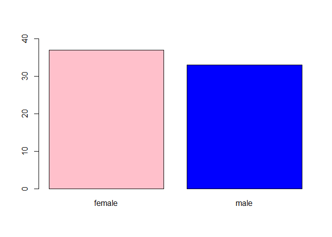
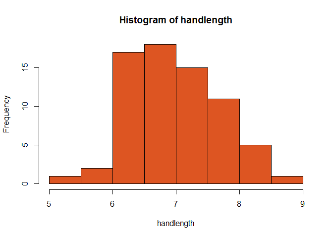
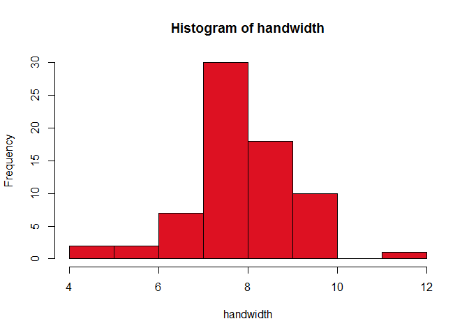

Height Prediction
================

GitHub Documents
----------------


Handsize Dataset, which is to be used to see if we can predict the height Dataset was gotten from this site <http://serc.carleton.edu/sp/cause/cooperative/examples/18172.html> From web findings the dataset belongs to Prof. Carl Lee and Prof. Felix Famoye. Just trying to be on the safe side.. hahahaha

Including Code
--------------

You can include R code in the document as follows: \#Kickoff \#Loading the Dataset

``` r
data = read.csv('C:/Users/Gabrielahrlr/Desktop/Data Science Specialization/Regression/boss.csv',header=TRUE)
```

Looking up the structure of the data!

``` r
str(data)
```

    ## 'data.frame':    70 obs. of  5 variables:
    ##  $ user_type  : Factor w/ 2 levels "instructor","student": 2 2 2 2 2 2 2 2 2 2 ...
    ##  $ Gender     : Factor w/ 2 levels "female","male": 1 1 1 2 1 1 1 1 1 1 ...
    ##  $ hand_length: num  6.5 6.5 7 7 5 5.8 7 6.5 6.5 7 ...
    ##  $ hand_width : num  7.5 8 7.25 8.5 6 6 8.5 7 7.5 5 ...
    ##  $ height     : num  62 60 62 72 67.5 62 68 70 67.2 62.5 ...

We can see an attribute called user\_type, in this case it is not needed for this analysis since it is not intuitive to understand the difference between instructors vs students hand metrics. The code below eliminates the feature or attibute.

``` r
new_data = data[,2:5]
str(new_data)
```

    ## 'data.frame':    70 obs. of  4 variables:
    ##  $ Gender     : Factor w/ 2 levels "female","male": 1 1 1 2 1 1 1 1 1 1 ...
    ##  $ hand_length: num  6.5 6.5 7 7 5 5.8 7 6.5 6.5 7 ...
    ##  $ hand_width : num  7.5 8 7.25 8.5 6 6 8.5 7 7.5 5 ...
    ##  $ height     : num  62 60 62 72 67.5 62 68 70 67.2 62.5 ...

Quick summary of the data!

``` r
summary(new_data)
```

    ##     Gender    hand_length      hand_width         height     
    ##  female:37   Min.   :5.000   Min.   : 4.000   Min.   :59.00  
    ##  male  :33   1st Qu.:6.500   1st Qu.: 7.500   1st Qu.:64.00  
    ##              Median :7.000   Median : 8.000   Median :68.00  
    ##              Mean   :7.154   Mean   : 8.029   Mean   :67.46  
    ##              3rd Qu.:7.500   3rd Qu.: 8.688   3rd Qu.:70.00  
    ##              Max.   :8.750   Max.   :11.500   Max.   :76.80

Viewing barplot of the gender distribution

``` r
gender = new_data$Gender
gender= table(gender)
color= c('pink','blue')
barplot(gender, col=color, ylim=c(0,40),xpd=FALSE)
```

Viewing Histogram of the Hand length

``` r
handlength= new_data$hand_length
range(handlength)
```

    ## [1] 5.00 8.75

``` r
hist(handlength, col='#dd5522')
```

 Viewing Histogram of the Hand Width

``` r
handwidth= new_data$hand_width
range(handwidth)
```

    ## [1]  4.0 11.5

``` r
hist(handwidth, col='#dd1122')
```



Including Plots
---------------

You can also embed plots, for example:
To be continued , outliers to be removed and regression model soon to be built and shown
